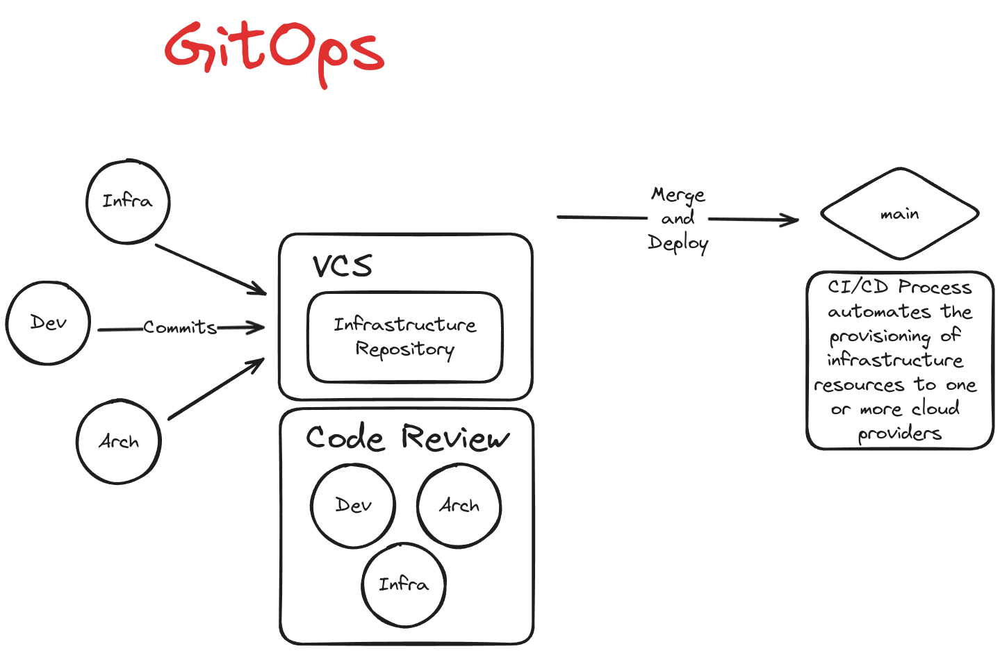

# Infrastructure as Code

Infrastructure as code is the practice and discipline of provisioning IT resources
using a machine-readable configuration file. The types of infrastructure that may be
covered by IaC can be both physical (bare-metal) or virtual machines.

## Infrastructure as Code Tools

1. [Hashicorp Terraform](https://www.terraform.io/)
   - There is also an Open-Source fork of Terraform called [OpenTofu](https://github.com/opentofu)
2. [Google Cloud Deployment Manager](https://cloud.google.com/deployment-manager/docs/)
3. [AWS Cloud Formation](https://docs.aws.amazon.com/cloudformation/)
4. [Azure Resource Manager](https://learn.microsoft.com/en-us/azure/azure-resource-manager)

## Infrastructure Lifecycle

Infrastructure lifecycle is a defined and distinct set of work phases which are used
by DevOps Engineers to plan, design, build, test, deliver, maintain, and retire
cloud infrastructure.

- Day 0 - Plan and Design
- Day 1 - Develop and Iterate
- Day 2 - Go live and maintain

### IaC's role in Infrastructure Lifecycle

- Reliability
  - IaC makes changes to infrastructure idempotent, consistent, repeatable, and
    predictable
- Manageability
  - Enable mutation via code
  - Revised, with minimal changes
- Sensibility
  - Avoid financial and reputational losses
  - In the case of critical systems (Government/Military) avoid loss of life
    when considering dependencies on infrastructure

## Non-Idempotent vs. Idempotent Changes to Configuration

As a DevOps engineer when I deploy my IaC configuration file it will provision
and launch two virtual machines:

- Non-Idempotent Case:
  - When I update the configuration, the changes are deployed as new resources
    and the old ones still exist leaving me to have to manage both sets
- Idempotent Case:
  - When I update the configuration, the changes are made to the existing
    infrastructure either by modifying the existing VMs or deleting and creating
    new ones

## Provisioning vs Deployment vs Orchestration

- Provisioning [Ansible, Chef, Puppet]
  - To prepare a server with systems, data and software, and make it ready for
    network operation.
    > When you launch a cloud service and configure it you are "provisioning"
- Deployment [Jenkins, Azure DevOps, CircleCI]
  - The act of delivering a version of your application to run a provisioned server.
- Orchestration [Kubernetes, Salt, Fabric]
  - The act of coordinating multiple systems or services

## Configuration Drift

Configuration "drift" is when configurations in an IT system gradually change over
time. It often happens when undocumented or unapproved changes are made to software,
hardward, and operating systems.

Going unnoticed, this can lead to larger issues including:

- Security vulnerabilities
- Compliance violations
- Downtime of essential services
- Data loss
- Unpredictable behavior in deployment

Luckily, you can detect configuration drift using a compliance tool (i.e. AWS Config,
Azure Policies). Some providers may also have a feature you can enable which can alert
you to possible configuration drift that may have happened. A big feature inside
terraform is its ability to manage and track state. If you've detected configuration
drift, correcting it may be possible using many of the same tools.

Some steps you can take to prevent the problem: - Immutable infrastructure: always create and destroy, never reuse. - Using methodologies like GitOps to version control IaC and peer review
changes with Pull Requests.

## GitOps

GitOps is used to automate the process of provisioning infrastructure and is built on three
smaller practices.

1. IaC - a git repository is used as the single source-of-truth for infrastructure definitions
2. MRs - Merge Requests are used as the change mechanism for which infrastructure updates will occur
3. CI/CD - Continuous Integration and Delivery is used to automate the deployment of infrastructure

> [GitLab Article](https://about.gitlab.com/topics/gitops/)
