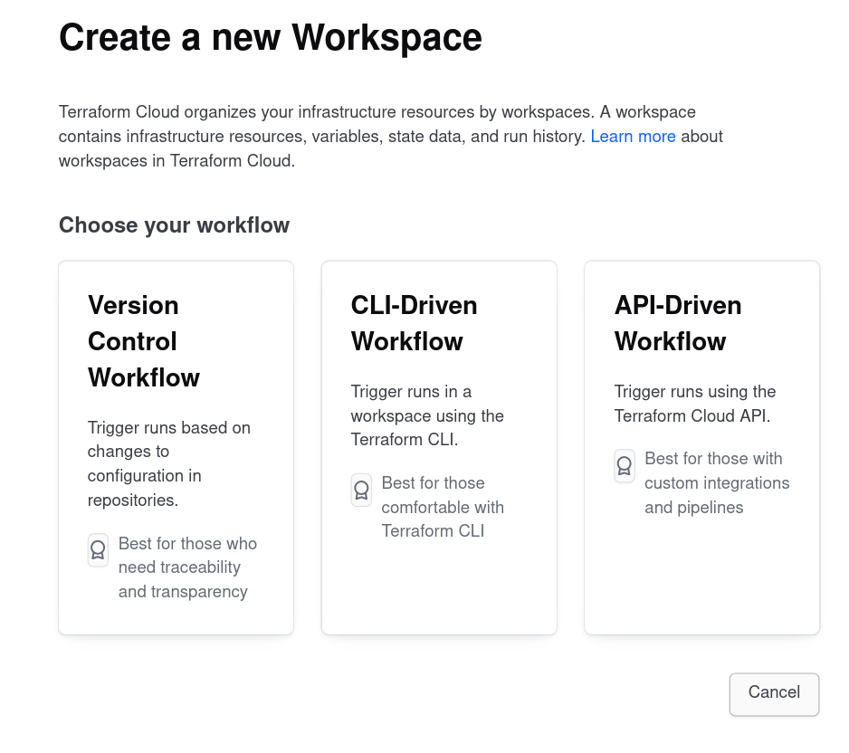

# Terraform Cloud

Terraform Cloud is an application that helps teams use Terraform together. You can
read more about it on their docs: 

[https://developer.hashicorp.com/terraform/cloud-docs](https://developer.hashicorp.com/terraform/cloud-docs)

## Terminology

- _**Organizations**_
    - An organization is a collection of workspaces
- _**Workspace**_
    - A workspace belongs to an organization
    - A workspace represents a single environment or stack
- _**Team**_
    - A team is composed of multiple members
    - A team can be assigned to a workspace
- _**Run**_
    - A run represents a single-run inside of the terraform 
    environment which executes a plan. (UI/VCS, API, or CLI driven)

## Terraform Cloud API

### API Tokens

Terraform Cloud supports three types of API Tokens: User, Team, and Organization.

- **Organization** API Tokens
    - Each organization can have one valid API token at a time
    - Have permissions across the entire organization
    - Only organization owners may generate or revoke an organization's token
    - Tokens are designed for creating and configuring workspaces and teams
- **Team** API Tokens
    - Each team can have one valid API token at a time
    - Allow access to the workspaces that the team has access to, without being
    tied to any specific user
    - Any member of a team can generate or revoke that team's token
    - When a token is regenerate, the previous token immediately becomes invalid
    - Tokens are designed for performing API operations over workspaces
- **User** API Tokens
    - Token permissions are inherited from the user they are associated with
    - May be used for a real user or a machine user (i.e. Build Server)

## Organizations

### Cost Estimation

Cost Estimation is a feature available in Terraform Cloud (>=Team,Governance plan).
It is only for specific cloud resources provided by AWS, Azure, and GCP.

### Organization-Level Permissions

Organization-Level permissions allow you to manage access to resources and settings
across an organization. 

- Manage Policies - create,edit, and delete an organization's Sentinel policies
- Manage Policy Overrides - override soft-mandatory policy checks
- Manage Workspaces - create and administrate all workspaces within an organization
- Manage VCS Settings - set of VCS providers and SSH keys available within an 
organization

### Private Registry

Terraform Cloud allows you to publish private modules for your organization within
the Terraform Cloud Private Registry. The publishing workflow inside of it supports:

- Module versioning
- Searchable functionality with support for filtering of available modules
- Configuration designer

All users in an organization can view its' private module registry. To Authenticate
users you should create a `user` or `team` token and scope it per your requirements.

## Workspaces

### Migrating Default Local State

To migrate a local Terraform project to Terraform Cloud:

1. Create a workspace in Terraform Cloud
2. Replace your Terraform Configuration with a remote backend:

    ```terraform
    terraform {
      cloud {
        hostname     = "app.terraform.io"
        organization = "my-org"

        workspace {
          name = "my-workspace"
        }
      }
    }
    ```
3. Run `terraform init`, and following the prompts for migrating your state to 
the new backend.

### Workspace-Level Permissions

Workspace-Level permissions allow you to manage access to resources and settings
for a workspace.

#### Fixed Permission Sets

These are pre-made permissions which you can use to quickly assign members of a workspace
granular access to functionality

- Read 
    - Read runs
    - Read variables
    - Read state versions
- Plan
    - Queue Plans
    - Read variables
    - Read state versions
- Write
    - Apply runs
    - Lock and unlock workspaces
    - Download sentinel mocks
    - Read and write variables
    - Read and write state versions

### Terraform Cloud Run Workflows

Terraform projects go into a Workspace, when you create one you are
prompted to select one of three workflows:

1. UI/VCS Driven:
    - Terraform cloud will be configured with a specific branch in you VCS via webhooks
    - Whenever pull requests are submitted for the branch a speculative plan is generated
    - Whenever a merge occurs to that branch, then a run is triggered on Terraform Cloud
2. API-Driven:
    - Workspaces are not directly associated with a VCS repo, and runs are not driven
    by webhooks on the VCS provider
    - A third-party tool or system will trigger runs via the upload of a configuration
    file using the Terraform Cloud API
    - The configuration file is a bash script that is packaged in an archive (`.tar.gz`)
    which you are pushing as a configuration version
3. CLI-Driven
    - Runs are triggered by the user running terraform CLI commands locally on their
    own machine



## Run

### Run Environment

When Terraform Cloud executes your terraform plan it runs them in its own Run Environment.

A run environment is a Virtual Machine (VM) or container intended for the execution
that inside of Terraform Cloud acts as a build server for provisioning you remote
infrastructure resources.

Terraform Cloud will inject the following environment variables automatically on
each run:

- `TFC_RUN_ID` - A unique identifier for the run
- `TFC_WORKSPACE_NAME` - Name of the workspace used in the run 
- `TFC_WORKSPACE_SLUG` - Full slug of the configuration used in the run
- `TFC_CONFIGURATION_VERSION_GIT_BRANCH` - Name of the branch used
- `TFC_CONFIGURATION_VERSION_GIT_COMMIT_SHA` - Full commit hash of the commit used
- `TFC_CONFIGURATION_VERSION_GIT_TAG` - Name of the git tag used

#### Terraform Cloud Agents

Cloud Agents is a paid feature of the Business plan to allow Terraform Cloud to
communicate with isolated, private, or on-premise infrastructure. The agent architecture
is pull-based, so no inbound connectivity is required, any agent you provision will poll
terraform cloud for work and carry out execution of that work locally.


