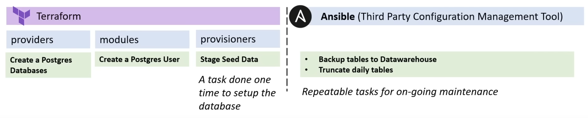

# Terraform Concepts

This lesson covers some important Terraform concepts that learners will keep in
mind as the course progresses.

## Terraform Provisioners

Provisioners install software, edit files, and provision machines created
with Terraform.

```terraform
resource "aws_ecs_service" "demo_app_service" {
  name            = var.demo_app_service_name
  cluster         = aws_ecs_cluster.demo_app_cluster.id
  task_definition = aws_ecs_task_definition.demo_app_task.arn
  launch_type     = "FARGATE"
  desired_count   = 1

  load_balancer {
    container_name = ""
    container_port = 0
  }

  network_configuration {
    subnets = []
  }
}
```

### local-exec

local-exec allows you to execute local commands after a resource
is provisioned. This could be your local machine, a build server, or
the Terraform Cloud run environment.

```terraform
resource "azuredevops_team" "developers" {
  name       = "Developers"
  project_id = uuid()
}

# null_resource is a placeholder for resources that have no specific association
# to a provider's resources.

resource "null_resource" "api_call" {
  provisioner "local-exec" {
    command = <<-EOT
      curl -X POST \
        -H "Content-Type: application/json" \
        -d '{"project_id": "${azuredevops_team.developers.project_id}"}' \
        https://interal.organization.com/api/projects
    EOT
  }

  # A triggers or connection block can be used inside of null_resource
  triggers = {}
  connection = {}
}

# "null_resource" may be replaced in some cases by "terraform_data" which implements
# the standard resource lifecycle but can be used without requiring or configuring
# a provider

resource "terraform_data" "api_call" { /* ... */ }
```

### remote-exec

remote-exec allows you to execute commands on a target resource, after a resource
is provisioned.

```terraform
resource "aws_instance" "web" {
  provisioner "remote-exec" {
    scripts = [
      "./setup-users.sh",
      "/usr/local/bin/bootstrap"
    ]
  }

  ami           = ""
  instance_type = ""
}
```

### File Provisioners

File Provisioner is used to copy files or directories from host machine to the
newly created resource. You may use a connection block to tell a provisioner or
resource how to establish a connection to a resource

```terraform
resource "aws_instance" "web" {
  provisioner "file" {
    source      = "conf/myapp.conf"
    destination = "/etc/myapp.conf"
  }

  connection {
    type     = "ssh"
    user     = "root"
    password = "${var.root_password}"
    host     = "${var.host}"
  }

  ami           = ""
  instance_type = ""
}
```

## Terraform Providers

Providers are Terraform Plugins that allow you to interact with:

-   Cloud Service Providers
-   Software as a Service Providers
-   Other APIs (i.e. Kubernetes)

[Terraform Registry](https://registry.terraform.io/)

```terraform
terraform {
  required_version = ">= 1.2.0"

  required_providers {
    aws = {
      source  = "hashicorp/aws"
      version = "~> 4.16"
    }
  }
}
```

> ### Terraform Cloud - Private Registry
>
> Terraform Cloud allows you to publish private modules for your organizations within
> the Terraform Cloud Private Registry.

#### Viewing Providers in the Command-Line

```bash
Usage: terraform [global options] providers [options] [DIR]

  Prints out a tree of modules in the referenced configuration annotated with
  their provider requirements.

  This provides an overview of all of the provider requirements across all
  referenced modules, as an aid to understanding why particular provider
  plugins are needed and why particular versions are selected.

Subcommands:
    lock      Write out dependency locks for the configured providers
    mirror    Save local copies of all required provider plugins
    schema    Show schemas for the providers used in the configuration
```

## Terraform Modules

A Terraform module is a group of configuration files that provide common configuration
policy for a given resource, reducing the boilerplate that you have to write

### AWS VPC Resource

```terraform
data "aws_region" "current" {}

resource "aws_vpc_ipam" "test" {
  operating_regions {
    region_name = data.aws_region.current.name
  }
}

resource "aws_vpc_ipam_pool" "test" {
  address_family = "ipv4"
  ipam_scope_id  = aws_vpc_ipam.test.private_default_scope_id
  locale         = data.aws_region.current.name
}

resource "aws_vpc_ipam_pool_cidr" "test" {
  ipam_pool_id = aws_vpc_ipam_pool.test.id
  cidr         = "172.20.0.0/16"
}

resource "aws_vpc" "test" {
  ipv4_ipam_pool_id   = aws_vpc_ipam_pool.test.id
  ipv4_netmask_length = 28
  depends_on          = [
    aws_vpc_ipam_pool_cidr.test
  ]
  cidr_block = ""
}
```

### AWS VPC Module

```terraform
module "vpc" {
  source = "terraform-aws-modules/vpc/aws"

  name = "my-vpc"
  cidr = "10.0.0.0/16"

  azs             = ["eu-west-1a", "eu-west-1b", "eu-west-1c"]
  private_subnets = ["10.0.1.0/24", "10.0.2.0/24", "10.0.3.0/24"]
  public_subnets  = ["10.0.101.0/24", "10.0.102.0/24", "10.0.103.0/24"]

  enable_nat_gateway = true
  enable_vpn_gateway = true

  tags = {
    Terraform = "true"
    Environment = "dev"
  }
}
```

## Terraform Responsibilities

The below diagram highlight the separation of concerns by configuration vs another tool Ansible.


